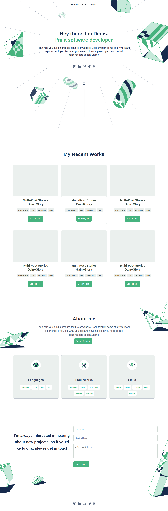

# Dan-portfolio

# Set up and mobile skeleton

> In this project, I deploy my portfolio website.

Click [here](https://dd-obua.github.io/Dan-portfolio/) to access.

## Built With

- HTML & CSS

## Getting Started

**This is the first part of the mobile version of my portfolio website.**

👤 **Obua Denis Daniel**

- GitHub: [@githubhandle](https://github.com/dd-obua/)
- Twitter: [@twitterhandle](https://twitter.com/DenisDanielObu1)
- LinkedIn: [LinkedIn](https://www.linkedin.com/in/denis-daniel-obua-99024a229/)

## 🤝 Contributing

Contributions, issues, and feature requests are welcome!

Feel free to check the [issues page](../../issues/).

## Show your support

Give a ⭐️ if you like this project!

## Acknowledgments

- I recognize the contributions of my learning pertners to the success of this project.

## 📝 License

This project is [MIT](./MIT.md) licensed.
